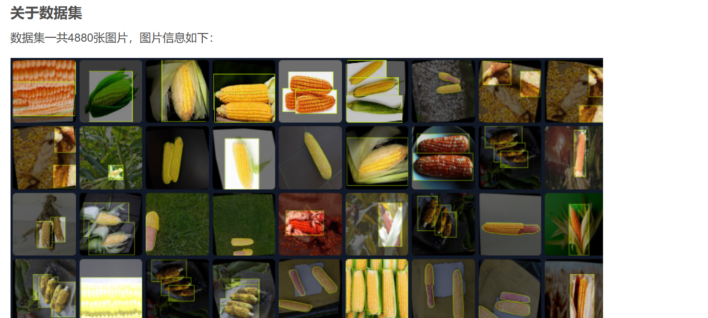

# "Intelligent Dock Shipyard Kitchen Odor Concentration Monitoring System Based on YOLOv8" (including source code, complete dataset, visualization interface, deployment tutorial) can be deployed 
simply.

15.91MB ZIP
The project source code comes from a personal graduation design, all tests pass, including the source code, dataset, visualization page, and deployment instructions, which can generate core indicator 
curve graphs, confusion matrix, F1 score curve, precision-recall curve, validation set prediction results, and label distribution diagram. Only after successful operation is the resource uploaded, 
and the defense of the graduation thesis will definitely convince with an absolute score above 85, so you can rest assured about downloading and using it. This includes one-stop services for source 
code, dataset, visualization page, and deployment instruction, so you can use it immediately.
In the field of deep learning and computer vision, target recognition is the study of how to let computers recognize specific objects through image recognition.
In recent years, with the development of deep neural networks, target recognition technology has made great progress.
Corn recognition as an important application in the agricultural field, plays an important role in promoting intelligent agriculture.
This document introduces the corn recognition dataset, which contains 4880 high-definition images, covering rich scenarios and different lighting conditions. These images are precisely labeled and 
can be used to train deep learning models.
The corn recognition dataset's image data is divided into three parts: train, valid, and test.
Train represents the main part of the training set, which is mainly used for training deep neural network models and usually contains the most samples;
Valid represents the validation set, used for model training process parameter optimization and evaluation of model generalization ability, preventing overfitting;
Test represents the testing set, used for final evaluation of model performance after model training.
Such division ensures that the model's performance on unseen data, thereby ensuring the model's generalization capability.
This dataset supports the yolo v11 format of annotations, YOLO (You Only Look Once) is a popular real-time object detection system that treats object detection as a regression problem, directly 
predicting bounding boxes and category probabilities in images.
The v11 version of YOLO has further improved speed and accuracy, allowing it to more quickly and accurately recognize corn images while ensuring real-time performance and enhancing recognition 
accuracy to the greatest extent possible.
The model trained using this dataset can achieve a correct recognition rate of up to 98.6%, indicating that the corn recognition model has very high accuracy and reliability, meeting the needs of 
practical applications.
In the field of agriculture, this will help improve efficiency and precision in crop detection, pest and disease identification, and yield estimation, which is very important for realizing the 
intelligence and automation of agricultural production.
As the demand for agricultural automation and intelligence grows, there is an increasing need for high-precision target recognition technology.
The release of the corn recognition dataset undoubtedly promotes research and development in related fields.
Due to the complexity of agricultural environments, the shape, size, color, etc. of targets may vary greatly, so building a strong generalized corn recognition model is very challenging.
Moreover, in addition to using the yolo v11 format of annotations, researchers can also try other advanced target detection algorithms such as Faster R-CNN and SSD (Single Shot MultiBox Detector) to 
further enhance recognition accuracy and robustness.
For developers and researchers, such datasets can greatly facilitate their research work, shorten development cycles, and improve development quality.
At the same time, the high recognition accuracy of the corn recognition dataset also provides a reliable technical guarantee for industrial applications in related fields.
Looking forward, with the continuous development of deep learning technology, we can expect to see more innovative applications in areas such as agricultural automation and precision agriculture.

## Images

Here is a pay link on Stripe ( https://buy.stripe.com/3cs8yP7sY87d0vu9AB ). Please contact me lonlonago@foxmail.com after funding $89, and I will send you a complete data files , thank you!

